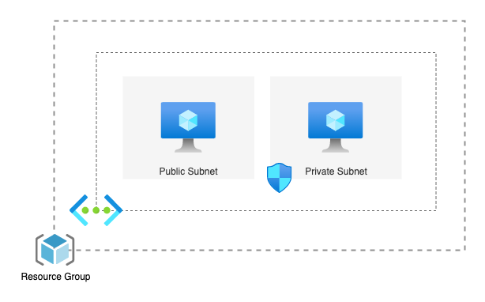
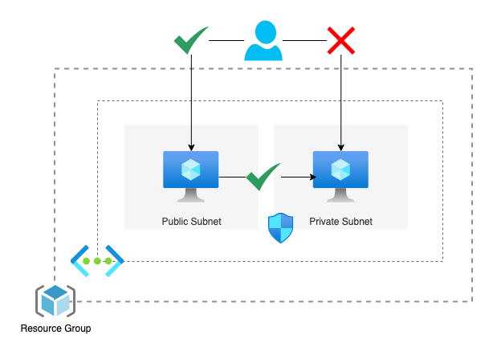

# Azure VNet/Subnet Lab

## Overview

Azure Virtual Networks (VNets) offer a way to logically isolate resources within Azure. Within a VNet, you can segment your resources into subnets, providing further control and security. Setting up a VNet with both a private and a public subnet is a common practice:

- **Private subnet:** This subnet is not directly accessible from the internet. It's ideal for resources that need to communicate with each other within the VNet but don't require public exposure. This enhances security for sensitive data and applications.

- **Public subnet:** This subnet has a public IP address space, allowing resources deployed within it to be accessed directly from the internet. This is suitable for resources like web servers or APIs that need to be publicly available.

By utilizing both private and public subnets within a VNet, you can achieve a balance between security and accessibility for your Azure resources.

To illustrate network connectivity concepts, this lab will walk you through creating a VNet with public and private subnets, and deploying VMs. You'll then explore how resources in these subnets can communicate (or not) with each other.

### Prerequisites

1. Azure account
2. [Azure CLI](https://learn.microsoft.com/en-us/cli/azure/install-azure-cli) installed

## Manually Create Resources

1. Create resource group

    1. From the main Azure portal page, click Resource Groups or use the search bar at the top of the screen.
    2. Click `+ Create`
    3. Verify the correct subscription is selected, enter a Resource group name, click `Review + create`, then `Create`. Remember this name for all resources created in this lab.

2. Create VNet

    1. From the search bar, search `Virtual networks` and click the `Virtual networks` result
    2. Click `+ Create` to begin creating an Azure virtual network
        - This is the *entire* network. We’ll break this down into two subnets in a later step.
    3. Verify your subscription and resource group, then give the network a name.
    4. Click `Next`, leave the checkboxes unchecked on the `Security` tab, then click `Next`
        - The services on Security are out of scope for this particular lab
    5. On the IP addresses screen, let’s make our overall network a little smaller. Click the dropdown with our CIDR slash (mine defaulted to /16) and update to /26.
        - Ignore errors for the default subnet - we're deleting it
    6. Delete the default subnet and click `Add a subnet`
        1. In the `Add a subnet` page we’ll first create our public subnet. Enter the following information:
            - Name: `public-subnet`
            - Size: /27 (32 addresses)

            

        2. Leave the rest of the configuration as the default settings and click `Add`
        3. Click `Add a subnet` again, entering the following on the `Add a subnet` page:
            - Name: `private-subnet`
            - Size: /27 (32 addresses)
            - Enable private subnet: check the box
            - Network security group: `Create new` and name `private-sg` . Click `Ok`.

            

        4. Leave the rest of the configuration as the default and click “Add”
    7. Once both subnets have been added, click `Review + create` then `Create`. After a few seconds the deployment should complete.

        

3. Update `private-sg` to deny all inbound access

    1. After your network is finished deploying you should see `private-sg` listed in the deployment details. Click the name to open the Overview page.

        

    2. Under `Settings`, open `Inbound security rules` , then `Add`

        

    3. Create a security rule with the following information:
        1. Source: `Service Tag`
        2. Source service tag: `VirtualNetwork`
        3. Source port ranges: `*`
        4. Destination: `Any`
        5. Service: `Custom`
        6. Destination port ranges: `*`
        7. Protocol: `Any`
        8. Action: `Deny`
        9. Priority: `1000`
        10. Name: `DenyVnetInbound`

        

    4. Click `Save`
    5. We have now prevented access to any resource not within `private-subnet`.

4. Create virtual machines in both subnets

    1. Next, create a public virtual machine with the following configurations

        - Basics
            - Resource group: your resource group name
            - Virtual machine name: `public-vm`
            - Image: Ubuntu Server 20.04 LTS
            - Size: Verify `Standard_B1s` is selected
            - Administrator Account
                - Authentication type: SSH public key
                - Username: `azureuser`
                - SSH public key source: Generate new key pair
                - Key pair name: `public-vm-ssh-key`

        - Networking
            - Virtual network: your VNet from step 2
            - Subnet: `public-subnet`
            - Public IP: leave the default
            - NIC network security group: `Basic`
            - Public inbound ports: `Allow selected ports`
            - Select inbound ports: `SSH (22)`
            - Delete NIC when VM is deleted: check the box (out of scope for the lab)

        

    2. Click “Review + create”, verify the details, then click “Create”. Be sure to download the private key when the “Generate new key pair” popup appears. Save it in a easily accessible location on your computer. They can be deleted after completion of this lab.

    3. Now lets create a virtual machine in our private subnet following similar steps as above with a few changes

        - Basics
            - Resource group: your resource group name
            - Virtual machine name: `private-vm`
            - Image: Ubuntu Server 20.04 LTS
            - Size: Verify `Standard_B1s` is selected
            - Administrator Account
                - Authentication type: SSH public key
                - Username: `azureuser`
                - SSH public key source: Generate new key pair
                - Key pair name: `private-vm-ssh-key`

        - Networking
            - Virtual network: your VNet from step 2
            - Subnet: `private-subnet`
            - Public IP: None
            - Delete NIC when VM is deleted: check the box (out of scope for the lab)

        

    4. Just like last time, be sure to download your private-vm-ssh-key to the same location as the previous key.

## Use Bicep to Deploy Resources

WIP

## Test Virtual Machine connectivity

1. Attempt SSH into private VM

    Now that we have everything setup, lets try to connect to our private VM instance.

    1. Open the Virtual Machines page and select the `private-vm` instance. Note the private IP address.

        

    2. On the left hand side, click `Connect`
    3. Select `Native SSH`
    4. Verify you have the correct local machine OS in the dropdown at the top. For this example we will use macOS.
        - Depending on your operating system you will see different instructions
    5. Enter the location on your computer where the `private-vm-ssh-key.pem` file is stored.
    6. Open a terminal (Linux/macOS) or PowerShell (Windows)
    7. Run chmod command (if present) to assign read-only access to your `private-vm-ssh-key.pem` file.

        

    8. Paste the SSH command and hit enter.
    9. After a little bit you should see an error similar to the following:

        

    Why did we get the error in our last step? If you noticed when we created our private VM we did not assign a public IP. In the SSH command we attempted to connect using the private IP address. Since it is not publicly available our command times out.

2. SSH into the public VM

    1. Go back to Azure, select  `public-vm`, `Connect`, and use the `Native SSH` option.
    2. Verify the correct local machine OS is checked, enter the folder location of your `public-vm-ssh-key.pem`
    3. Run chmod command, then paste the SSH command into Terminal (Linux/MacOS) or PowerShell (Windows) and hit enter.
    4. When it asks `Are you sure you want to continue connecting?` type `yes` and hit enter.
    5. You should be presented with a `Welcome to Ubuntu 20.04.6 LTS` message, and see `azureuser@public-vm` . Hooray! You’ve connected to the `public-vm` machine!

        

        Now that we've connected, lets test out our vm's connectivity to the internet. Run the following `ping` commands and see what they return.

        - `ping -c 3 microsoft.com`
        - `ping -c 3 google.com`
        - `ping -c 3 aws.com`

        

        As you can see, our VM is open to the public internet on port 22 (what we used to login with SSH) and it can reach out to the internet.

    6. From `public-vm`, try to ping `private-vm` , updating the command with the private IP address. This can be found on the `private-vm` Overview screen under Networking.
        1. `ping -c 3 <private_ip>`
        2. i.e.: `ping -c 3 10.0.0.36`

        

        Why do we get this timeout? Remember back when we setup the private subnet we added a network security group and denied all inbound traffic. Lets go update to allow network access from our `public-vm` to `private-vm`.

3. Update subnet to allow traffic from public subnet

    1. Open `Virtual machines`, open both `private-vm` and `public-vm`, then note both private IP address. We'll use this in later steps.

        

    2. Open `Network security groups` and click on `private-sg`.
    3. Click `Inbound security rules` and add a new inbound rule.  
    4. Add new inbound security rule to allow `public-vm` access to `private-vm`
        - Source: `IP Address`
        - Source IP address/CIDR ranges: `10.0.0.4/32` (update with your `public-vm` private IP and add `/32`)
        - Destination: `IP Address`
        - Destination IP addresses/CIDR ranges: `10.0.0.36/32` (update with your `private-vm` private IP and add `/32`)
        - Service: `Custom`
        - Destination port ranges: `*`
          - In the real world you would set this to the exact ports necessary. For testing purposes we're allowing all.
        - Priority: `999`
          - This value needs to be lower than `DenyVnetInbound` so it will be evaluated first.
        - Name: `AllowPublicVMToPrivateVM`
    5. Click Add. Wait a few seconds to allow your new security rule to take effect.

4. Ping `private-vm` from `public-vm`

    1. Navigate back to your terminal/Powershell window.
    2. Try to ping `private-vm` again
        1. `ping -c 3 <private_ip>`
        2. i.e.: `ping -c 3 10.0.0.36`

    

    Hooray! We get a successful connection!

We've done a lot in this section. To summarize, we SSH'd into our public virtual machine, tried to connect to our private virtual machine, then setup the network security group to allow our `public-vm` to ping `private-vm`.

## Teardown

### Bicep

Steps to tear down Resource Manager stack

### Manual

- Delete Resource Group

    1. From the Azure home page, click `Resource groups`.
    2. Click the name of your resource group created at the beginning of the lab.
    3. Click `Delete resource group`, check `Apply force delete` checkbox, enter the resource group name for confirmation, and finally `Delete`
    4. All resources should be removed.

## Summary

This lab delved into the fundamental concepts of network connectivity within Azure Virtual Networks (VNets). You successfully created a VNet with both public and private subnets, providing a hands-on environment to explore how resources in each subnet interact.

Through this lab, you gained practical experience in:

- **Creating a VNet and Subnets:** You learned how to define an Azure VNet and configure it with separate public and private subnets, understanding the purpose of each subnet in network isolation.
  
- **Deploying Virtual Machines:** You deployed virtual machines (VMs) into both public and private subnets, establishing the foundation for exploring network connectivity.
  
- **Testing Network Connectivity:** You tested communication between VMs in different subnets and with the internet, gaining insights into the default firewall rules and the importance of Network Security Groups (NSGs) for granular control.

By completing this lab, you have gained a solid foundation in understanding how network connectivity works within Azure VNets and the role of subnets in segregating resources for enhanced security and control.
