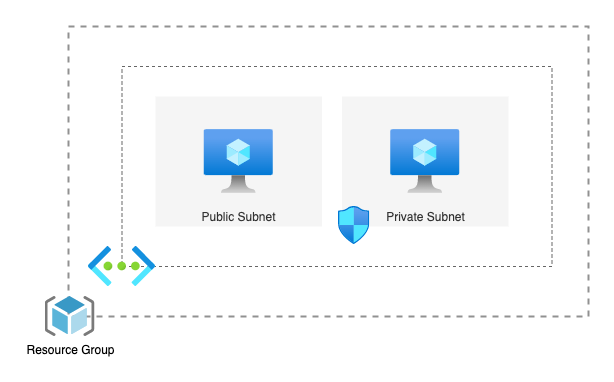

# Azure Subnets Lab

## Overview

Azure Virtual Networks (VNets) offer a way to logically isolate resources within Azure. Within a VNet, you can segment your resources into subnets, providing further control and security. Setting up a VNet with both a private and a public subnet is a common practice:

- **Private subnet:** This subnet is not directly accessible from the internet. It's ideal for resources that need to communicate with each other within the VNet but don't require public exposure. This enhances security for sensitive data and applications.

- **Public subnet:** This subnet has a public IP address space, allowing resources deployed within it to be accessed directly from the internet. This is suitable for resources like web servers or APIs that need to be publicly available.

By utilizing both private and public subnets within a VNet, you can achieve a balance between security and accessibility for your Azure resources.

To illustrate network connectivity concepts, this lab will walk you through creating a VNet with public and private subnets, and deploying VMs. You'll then explore how resources in these subnets can communicate (or not) with each other.

## Prerequisites

1. Azure account
2. [Azure CLI](https://learn.microsoft.com/en-us/cli/azure/install-azure-cli) installed
